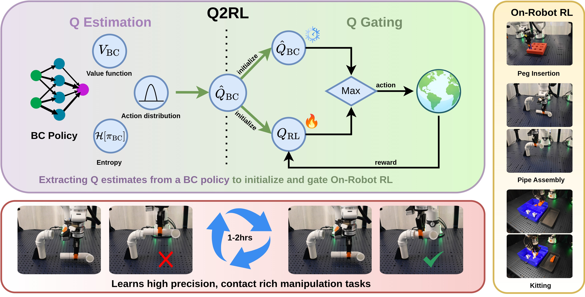

<div align="center">

# 🍋 When Life Gives You BC, Make Q-functions:🍹 <br>Extracting Q-values from Behavior Cloning <br>for On-Robot Reinforcement Learning

### [**Paper**](https://q2rl.rai-inst.com/static/pdf/q2rl.pdf) | [**Website**](https://q2rl.rai-inst.com/)

[Lakshita Dodeja](https://lakshitadodeja.github.io/website/)<sup>1,2</sup>,
[Ondrej Biza](https://ondrejbiza.com/)<sup>1</sup>,
[Shivam Vats](https://shivamvats.com/)<sup>2</sup>,
[Stephen Hart](https://www.linkedin.com/in/stephen-hart-3711666/)<sup>1</sup>, 
[Stefanie Tellex](https://h2r.cs.brown.edu/people/)<sup>2</sup>,
[Robin Walters](https://www.robinwalters.com/)<sup>3</sup>,
[Karl Schmeckpeper](https://sites.google.com/view/karlschmeckpeper)<sup>1</sup>, 
[Thomas Weng](https://thomasweng.com/)<sup>1</sup>

<sup>1</sup>Robotics and AI Institute, <sup>2</sup>Brown University, <sup>3</sup>Northeastern University




</div>

## Installation

We provide installation instructions with conda and uv.

### Install with conda
1. **Setup Conda Environment:**
    ```bash
    conda create -n q2rl python=3.10 -y
    conda activate q2rl
    ```
2. **Install other requirements and JAX:**
    ```bash
    pip install -r requirements.txt
    ```

3. **Install D4RL and Adroit Envs:**

    We use the D4RL and Adroit Envs versions from [WSRL](https://github.com/zhouzypaul/wsrl) repo. Copying instructions from WSRL:
    
    This fork incorporates the antmaze-ultra environments and fixes the kitchen environment rewards to be consistent between the offline dataset and the environment.
    ```
    git clone git@github.com:zhouzypaul/D4RL.git
    cd D4RL
    pip install -e .
    ```

    To use Mujoco, you would also need to install mujoco manually to `~/.mujoco/` (for more instructions on download see [here](https://github.com/openai/mujoco-py?tab=readme-ov-file#install-mujoco)), and use the following environment variables
    ```bash
    export LD_LIBRARY_PATH=$LD_LIBRARY_PATH:$HOME/.mujoco/mujoco210/bin
    export LD_LIBRARY_PATH=$LD_LIBRARY_PATH:/usr/lib/nvidia
    ```
  
    To use the adroit envs, you would need
    ```
    git clone --recursive https://github.com/nakamotoo/mj_envs.git
    cd mj_envs
    git submodule update --remote
    pip install -e .
    ```

    Download the adroit dataset from [here](https://drive.google.com/file/d/1yUdJnGgYit94X_AvV6JJP5Y3Lx2JF30Y/view) and unzip the files into `~/adroit_data/offpolicy_hand_data`.
    If you would like to put the adroit datasets into another directory, use the environment variable `DATA_DIR_PREFIX` (checkout the code [here](https://github.com/zhouzypaul/wsrl/blob/4b5665987079934a926c10a09bd81bc3c48ea9fa/wsrl/envs/adroit_binary_dataset.py#L7) for more details).
    ```bash
    export DATA_DIR_PREFIX=/path/to/your/data
    ```
4. **Install Robomimic:**
    
    We extract log probabilities and entropy of GMM files in `robomimic/robomimic/algo/bc.py` included in this repo. 
    ```
    cd robomimic 
    pip install -e .
    ```   
    
    Install `numpy` and `mujocopy` with these versions if other repos change their versions
    ```
    pip install mujoco==3.1.6 numpy==1.26.1
    ```
5. Activate the conda environment before running any scripts.

### Install with uv
1. Install [`uv`](https://docs.astral.sh/uv/)
2. Clone this repository with `git clone --recursive`.
2. Install Mujoco with `./scripts/install_mujoco.sh`
    a. Ensure that your system has the requisite Mesa development headers installed; on Ubuntu, run `sudo apt install libosmesa6-dev`
    b. Note that you will need to export the environment variables printed by `install_mujoco.sh` to your `.bashrc` or `.zshrc`, or manually export them in your shell before running any scripts
2. Install dependencies with `uv sync`.
3. To use the adroit envs, you would need
    ```
    git clone --recursive https://github.com/nakamotoo/mj_envs.git
    cd mj_envs
    git submodule update --remote
    uv pip install -e .
    ```

    Download the adroit dataset from [here](https://drive.google.com/file/d/1yUdJnGgYit94X_AvV6JJP5Y3Lx2JF30Y/view) and unzip the files into `~/adroit_data/`.
    If you would like to put the adroit datasets into another directory, use the environment variable `DATA_DIR_PREFIX` (checkout the code [here](https://github.com/zhouzypaul/wsrl/blob/4b5665987079934a926c10a09bd81bc3c48ea9fa/wsrl/envs/adroit_binary_dataset.py#L7) for more details).
    ```bash
    export DATA_DIR_PREFIX=/path/to/your/data
    ```
4. Either run scripts with `uv run` or execute `source .venv/bin/activate` to enter the virtual environment before running any scripts.

## Running Experiments

All BC policies and datasets are uploaded to huggingface [here](https://hf.co/collections/theaiinstitute/q2rl). 
Run `bash scripts/download.sh`. The script will install the Hugging Face CLI automatically if `hf` is not already installed.

We follow a similar structure to [WSRL](https://github.com/zhouzypaul/wsrl). 

All experiment scripts for `q2rl` and baselines are in the `experiments/` directory.
You can modify the paths in the example scripts based on your setup. 

Also export the repo to the python path `export PYTHONPATH=/path/to/q2rl:$PYTHONPATH`. 
The example scripts do this for you.

To kill a running experiment, find the wandb group name from `logs/`, then run `pkill -f "[wandb-group-name]"`.

## Changelog

- 2026-05-07: Initial public release.
- 2026-07-01: Bugfix `backend/data/` folder.


## Citation 
If you like our work please cite us: 
```
@inproceedings{dodeja2026q2rl,
  title     = {When Life Gives You BC, Make Q-functions:
               Extracting Q-values from Behavior Cloning
               for On-Robot Reinforcement Learning},
  author    = {Dodeja, Lakshita and Biza, Ondrej and Vats, Shivam and
               Hart, Stephen and Tellex, Stefanie and Walters, Robin and
               Schmeckpeper, Karl and Weng, Thomas},
  booktitle = {Robotics: Science and Systems (RSS)},
  year      = {2026},
}
```

## Credits
This repo is built upon the [WSRL](https://github.com/zhouzypaul/wsrl) and [SERL](https://github.com/rail-berkeley/serl) repositories. 

--------

This repository is released as-is to accompany a paper submission.
If you find any bugs, corrections, or issues that should be resolved for anyone looking to reproduce the results in this repository, please file an issue, and we will look at it as soon as we can.
For other improvements, including new features, we recommend creating your own fork of the repository.
